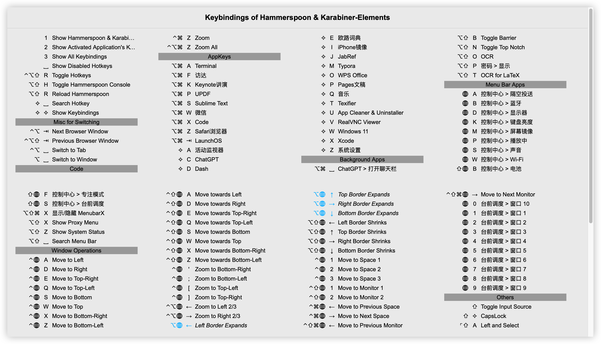
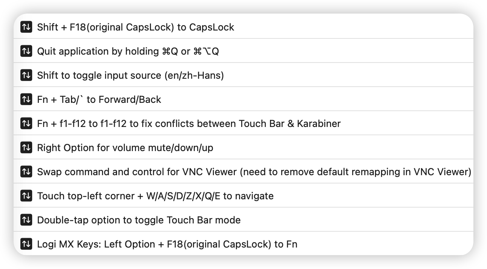

# Mouseless

Utilizing Hammerspoon and Karabiner-Elements to improve your productivity by operating fully via your keyboard and touchpad!

## Installation

Install the latest version of [Hammerspoon](https://www.hammerspoon.org/) and [Karabiner-Elements](https://karabiner-elements.pqrs.org/). You can either download them from official websites or by running below command:

```shell
brew install hammerspoon karabiner-elements --cask
```

Then clone this repository, rename `hammerspoon` to `.hammerspoon` and move it to your home directory, add  move `karabiner` to $HOME/.config. Finally, just launch Hammerspoon and Karabiner-Elements. Now you can throw away your mouse!

Note: Current version of Hammerspoon may experience a long delay during loading. You can fix it by adding a line at line 1412 in "/Applications/Hammerspoon.app/Contents/Resources/extensions/hs/window_filter.lua".

```lua
local function startAppWatcher(app,appname,retry,nologging,force)
  if not app or not appname then log.e('called startAppWatcher with no app') return end
 + if app:bundleID() == "com.apple.WebKit.WebContent" then return end
  if apps[appname] then return not nologging and log.df('app %s already registered',appname) end
  if app:kind()<0 or not windowfilter.isGuiApp(appname) then log.df('app %s has no GUI',appname) return end
  if not fnutils.contains(axuielement.applicationElement(app):attributeNames() or {}, "AXFocusedWindow") then
      log.df('app %s has no AXFocusedWindow element',appname)
      return
  end
  ...
end
```

## Features

### Hammerspoon

- Various self-customizable hotkeys. See [keybindings](./hammerspoon/config/keybindings.json).

  - Hotkeys to launch, activate or hide applications.

  - Hotkeys to search / switch tabs, windows or menu bar icons.

    

  - Hotkeys for monitor / window operation.

  - Hotkeys in specific applications or for specific windows (locale supported in most cases).

  - Hotkeys for operations in Control Center (since Big Sur).

  - Missed hotkeys for some applications like ⌘+W to close window.

  - Key remapping for virtual machines and remote desktops.

  - Hotkeys to visualize or search all hotkeys (hold modifiers to highlight).

    

    

- Monitoring applications and windows to automatically hide or quit applications.

- A menu bar item to automatically configure your network proxy (supports system proxy, `V2RayX`, `V2rayU`, `MonoProxyMac`)

  

- Input sources for specific applications.

- Keybindings with globe (fn) and touch-pad as a modifier

- Synchronize configurations and desensitizing them.

- Remove redundant text added by a website when you try to copy text on it.

### Karabiner-Elements

- Map CapsLock to F18 (for hyper modal required by my hammerspoon configuration).
- Touch pad-related hotkeys.
- Safe quitting applications.



## Acknowledgement

Some codes are taken from the following repositories:

- [HSKeybindings.spoon](https://github.com/Hammerspoon/Spoons/tree/master/Source/HSKeybindings.spoon)

- [chrome-pak-customizer](https://github.com/myfreeer/chrome-pak-customizer)

- [NIBArchive-Parser](https://github.com/MatrixEditor/nibarchive)
