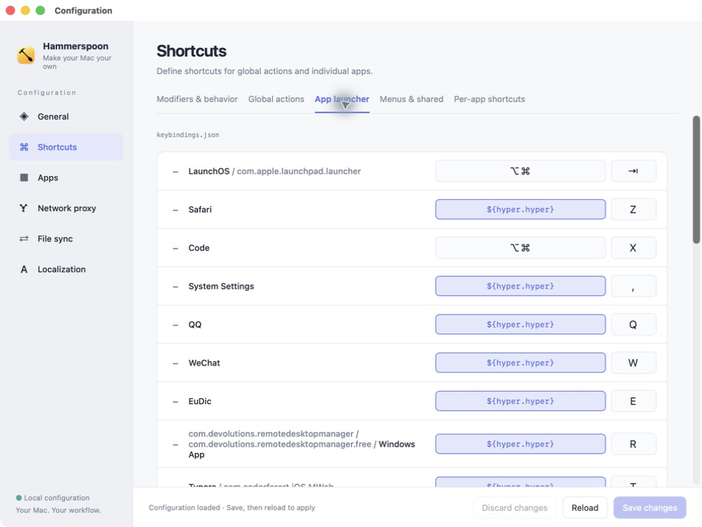
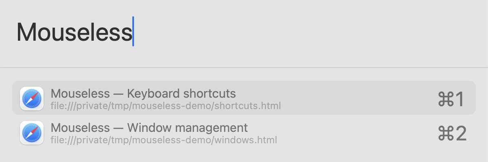
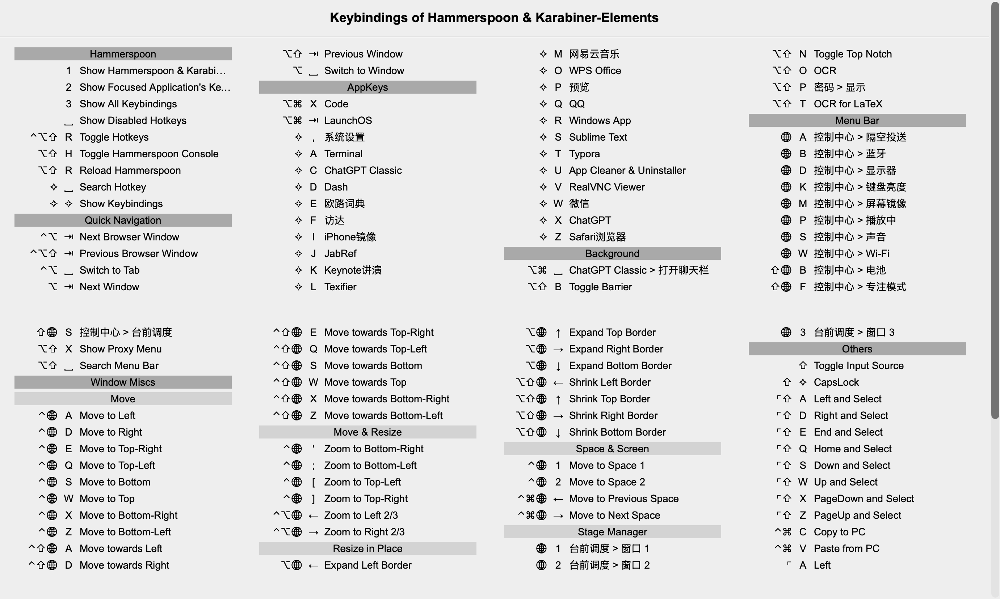
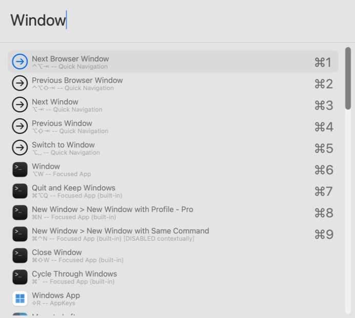
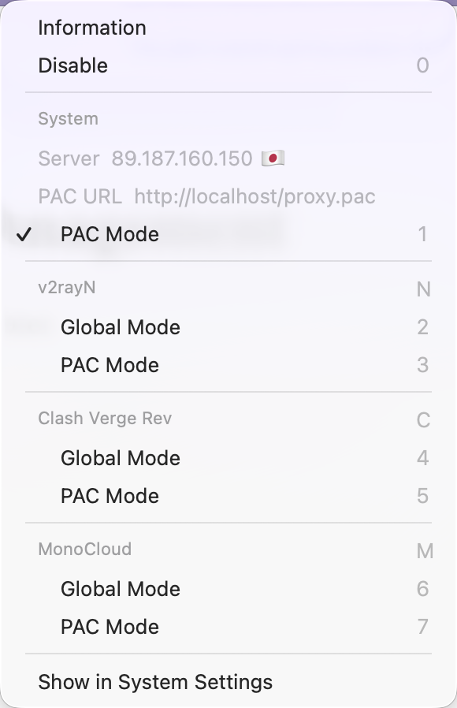
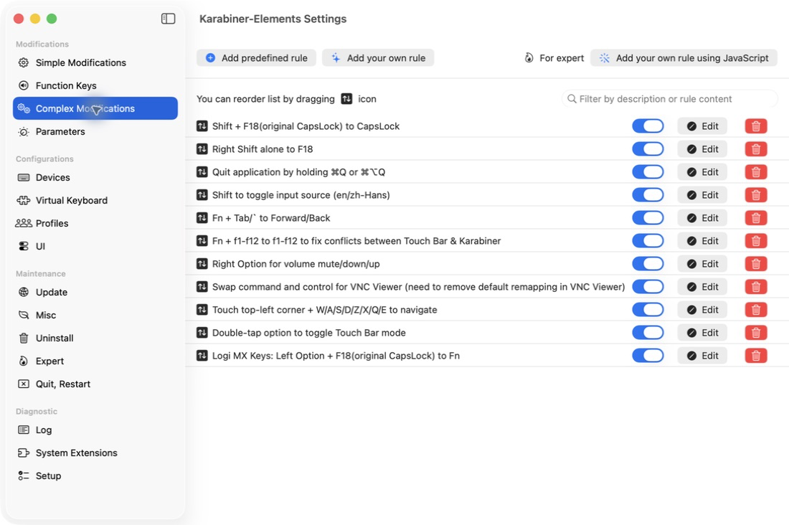

# Mouseless

Make your Mac work from the keyboard and trackpad. Mouseless combines Hammerspoon automation with Karabiner-Elements remapping to launch apps, find windows and tabs, navigate menus, arrange your workspace, and manage network proxies.

Customize shortcuts and automation in a local configuration window, or edit the same JSON files directly.



[Installation](#installation) · [Features](#features) · [Everyday shortcuts](#everyday-shortcuts) · [Configuration](#configuration) · [Troubleshooting](#troubleshooting)

## Installation

### 1. Install the apps

Install Hammerspoon and Karabiner-Elements. With Homebrew:

```sh
brew install --cask hammerspoon karabiner-elements
```

Launch both apps and complete their macOS setup prompts, including Accessibility for Hammerspoon and the input permissions and components requested by Karabiner-Elements. Some application automation also needs permission to control the target app.

### 2. Install the configuration

Use a checkout of this repository containing the `hammerspoon/` and `karabiner/` directories. Back up any existing configuration before copying or merging these files.

| Repository directory | Install location |
| --- | --- |
| `hammerspoon/` | `~/.hammerspoon/` |
| `karabiner/` | `~/.config/karabiner/` |

Copy the **contents** into those locations so the entry points are `~/.hammerspoon/init.lua` and `~/.config/karabiner/karabiner.json`. Keep the Hammerspoon `src`, `static`, `scripts`, `Spoons`, and `config` directories together.

These are personal configurations intended to be adapted. Before the first reload, review `config/application.json` for app lifecycle rules, `config/proxy.json` and the `proxy` section of `config/misc.json` for network behavior, and `config/sync.json` for local file paths. To start without file synchronization, use this in your installed `config/sync.json`:

```json
{
  "variable": {},
  "file": {}
}
```

Select the installed Karabiner profile and reload Hammerspoon from its menu bar menu. The default profile maps **Caps Lock → F18**, which Hammerspoon uses as **Hyper (✧)**. **Shift + Caps Lock** still toggles Caps Lock.

### 3. Make it yours

Open the configuration window from Terminal:

```sh
open 'hammerspoon://configuration'
```

You can also run `Configuration.show()` in the Hammerspoon console, or press **⌥⌘,** while a Hammerspoon app window or menu is active. Start with **Shortcuts → App launcher**, update your preferred apps, then choose **Save changes → Reload**.

## Features

### Find and switch without reaching for the mouse

Search windows, browser tabs, and supported PDF documents; cycle through windows or browser windows; launch, activate, and hide apps with dedicated shortcuts. App launcher bindings can specify several candidate apps for the same key.



*Tab search shown with local demonstration pages.*

Search menu bar status items and open their menus from the keyboard. App menus also gain letter- or index-based navigation where configured.

### Discover shortcuts as you work

Display a shortcut sheet containing custom bindings and the active app's menu shortcuts. Hold modifiers to highlight matching commands, or search for a command and execute it from the chooser.





### Arrange windows, displays, and Spaces

Move windows to screen edges and corners, tile them into halves or quarters, resize individual borders, and transfer windows between displays and Spaces. Focus another display or a Stage Manager window with a shortcut. Globe/Fn and trackpad corners provide additional modifiers.

### Adapt shortcuts to each app

Application- and window-specific bindings fill gaps such as closing windows, switching views, and navigating sidebars. Rules account for the active app and window, with localization helpers that read installed application resources and support custom menu translations.

Configure input sources per app, hide or quit selected apps after their last window closes, and adjust modifier mappings or shortcut suspension for remote desktop and virtual machine sessions. Available actions depend on the installed app, version, and exposed accessibility controls.

### Manage proxies from one menu

Switch system proxy configurations, launch supported clients, and select their routing modes. Integrations include **V2RayX, V2rayU, v2rayN, Clash Verge Rev, and MonoCloud**; the menu reflects the clients installed on your Mac.



The menu shows configured endpoints, the current selection, TUN status when detected, and an outbound IP/country lookup under **Server**. It reports lookup failures and supports authentication for that lookup with per-proxy Keychain credentials. Network conditions can select a configured proxy automatically.

Set endpoints in `proxy.json`; keep machine-specific entries in the optional, Git-ignored `private-proxy.json`. Automatic selection rules live in `misc.json`. Modes and endpoints must match your client configuration.

### Automate everyday tasks

- Open supported Control Center panels with Globe/Fn shortcuts.
- Keep the display awake from a menu bar toggle; its state survives a reload.
- Filter unwanted attribution text from copied content using configurable patterns.
- Synchronize selected files on change, with path variables and optional post-processing for redaction.

### Add keyboard and trackpad gestures

The Karabiner profile supplies the Hyper key, hold-to-quit behavior, input-source switching, Fn navigation, volume controls, Touch Bar rules, and remote-viewer modifier remapping. Touching the top-left trackpad corner turns selected letter keys into navigation keys.



Trackpad-dependent Karabiner rules require its Multitouch Extension to be enabled on your machine. Review device-specific and Touch Bar rules before adopting the entire profile.

## Everyday shortcuts

These bindings come from the checked-in configuration; your local edits take precedence. **✧ = hold Caps Lock**, **⌥ = Option**, **⌃ = Control**, **⇧ = Shift**, **⌘ = Command**.

| Action | Default shortcut |
| --- | --- |
| Show the shortcut sheet | Double-tap Caps Lock |
| Search shortcuts | ✧ Space |
| Search windows | ⌥ Space |
| Search tabs / supported documents | ⌃⌥ Space |
| Next / previous window | ⌥ Tab / ⇧⌥ Tab |
| Cycle browser windows | ⌃⌥ Tab |
| Search menu bar items | ⇧⌥ Space |
| Open proxy menu | ⇧⌥ X |
| Open Finder / Safari | ✧ F / ✧ Z |
| Tile window into a half | Fn ⌃ Arrow |
| Move window to a Space | Fn ⌃ 1–9 |
| Move window to a display | Fn ⌃⇧ 1–9 |
| Focus a display | ⌃⇧ 1–9 |
| Reload Hammerspoon | ⇧⌥ R |
| Open / hide Hammerspoon console | ⇧⌥ H |
| Suspend / resume custom hotkeys | ⌃⌥⇧ R |

The shortcut sheet and [keybindings.json](./hammerspoon/config/keybindings.json) cover the remaining bindings. Display and Space shortcuts are registered for the available targets.

## Configuration

### Use the local editor

The configuration window groups settings into **General, Shortcuts, Apps, Network proxy, File sync, and Localization**. Edit fields directly, expand nested rules, add entries, or use the JSON editor for a complete file.

**Save changes** saves only the file associated with the current tab and preserves drafts for other files. It creates a `.json.bak` backup of an existing file and checks for external changes before replacing it. **Reload** applies saved settings and reopens the editor; save or discard unsaved drafts first.

Closing the editor retains drafts until Hammerspoon quits or reloads. **Refresh files** rereads files from disk and asks before discarding unsaved edits. The editor runs locally without a web server or remote assets.

See the [configuration editor guide](./hammerspoon/static/configuration/README.md) for details.

### Edit JSON directly

Files live under `~/.hammerspoon/config/` after installation.

| File | What it controls |
| --- | --- |
| [keybindings.json](./hammerspoon/config/keybindings.json) | Modifier macros, global and per-app shortcuts, app launchers, remote desktop modifiers |
| [application.json](./hammerspoon/config/application.json) | App lifecycle, input sources, menu bar items, and app-specific behavior |
| [misc.json](./hammerspoon/config/misc.json) | Polling interval, clipboard filters, verification-code patterns, and automatic proxy selection |
| [proxy.json](./hammerspoon/config/proxy.json) | System and client proxy endpoints |
| `private-proxy.json` (optional) | Local proxy definitions excluded from Git |
| [sync.json](./hammerspoon/config/sync.json) | File mappings, path variables, and post-processing commands |
| [localization.json](./hammerspoon/config/localization.json) | Custom application menu translations |

For example, this entry inside `hotkeys.appkeys` binds Hyper + F to Finder:

```json
{
  "mods": "${hyper.hyper}",
  "key": "F",
  "bundleID": "com.apple.finder"
}
```

Modifier macros are defined in `hyper`; `${hyper.hyper}` resolves to the default `F18` Hyper key. Other bindings accept modifier arrays such as `["control", "option"]`.

Reload after editing JSON. Lua file changes trigger an automatic reload. Back up local customizations before updating from the repository.

## Troubleshooting

| Symptom | Check |
| --- | --- |
| Hyper bindings do not work | Confirm Karabiner's active profile maps Caps Lock to F18 and matches `hyper.hyper`. |
| All custom shortcuts stop responding | Try ⌃⌥⇧ R to resume hotkeys; check Accessibility and the Hammerspoon console. |
| Saved configuration has no effect | Save changes, then Reload. JSON edits alone do not reload the configuration. |
| An app-specific action is missing | Confirm the app/window context, app version, language, and automation permissions. |
| Trackpad navigation does not respond | Check Karabiner's Multitouch Extension and device-specific configuration. |
| Proxy switching or server lookup fails | Check client availability, configured ports, routing mode, and the error shown by the menu. |
| Localization extraction fails | Check that `/usr/bin/python3` is available; several extractors use it. Vendored dependencies are included. |

For unusually slow startup, inspect the console first. [init.lua](./hammerspoon/init.lua) documents a targeted `hs.window.filter` workaround for WebKit helper processes on affected Hammerspoon builds. It involves a change inside Hammerspoon itself and may need reapplying after an app update.

## Project layout

```text
hammerspoon/
  init.lua                 Startup, hotkey registration, and watchers
  config/                  Editable JSON configuration
  src/app/                 Application behavior and shortcut handlers
  src/modal/               Hyper, Globe, double-tap, and trackpad modifiers
  src/system/              Proxy, menu bar, and Control Center integration
  src/utils/               Menu and localization helpers
  static/configuration/    Local configuration editor
  scripts/                 Resource extractors and helper scripts
  Spoons/                  Bundled Hammerspoon extensions
karabiner/                 Keyboard profile and Touch Bar helper
assets/                    README screenshots
```

## Acknowledgements

Mouseless includes or builds on work from HSKeybindings.spoon, chrome-pak-customizer, NIBArchive-Parser, dnfile, and pefile. See [vendored dependency notes](./hammerspoon/scripts/vendor/README.md) and the [retained license files](./hammerspoon/scripts/vendor/licenses/) for upstream sources and attribution.
